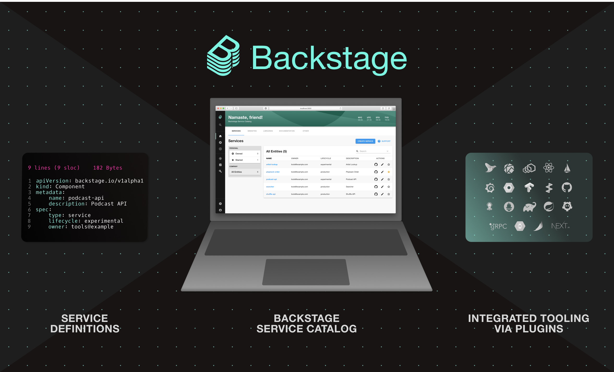

# [ 박진슬 : Backstage - 2.Catalog ]{#title-text} {#title-heading .pagetitle}


Created by [ 박진슬]{.author} on 2024 1월 29


- [\[ 박진슬 : Backstage - 2.Catalog \]{#title-text} {#title-heading .pagetitle}](#-박진슬--backstage---2catalog-title-text-title-heading-pagetitle)
- [개요 {#Backstage-2.Catalog-개요}](#개요-backstage-2catalog-개요)
  - [What is a Software Catalog? {#Backstage-2.Catalog-WhatisaSoftwareCatalog?}](#what-is-a-software-catalog-backstage-2catalog-whatisasoftwarecatalog)
  - [Catalog 가 가져오는 효과 {#Backstage-2.Catalog-Catalog가가져오는효과}](#catalog-가-가져오는-효과-backstage-2catalog-catalog가가져오는효과)
  - [Finding software in the catalog {#Backstage-2.Catalog-Findingsoftwareinthecatalog}](#finding-software-in-the-catalog-backstage-2catalog-findingsoftwareinthecatalog)
  - [Starring components {#Backstage-2.Catalog-Starringcomponents}](#starring-components-backstage-2catalog-starringcomponents)
  - [Plugins 을 통한 통합 도구 {#Backstage-2.Catalog-Plugins을통한통합도구}](#plugins-을-통한-통합-도구-backstage-2catalog-plugins을통한통합도구)
- [Catalog 에 components 추가 {#Backstage-2.Catalog-Catalog에components추가}](#catalog-에-components-추가-backstage-2catalog-catalog에components추가)
  - [GitHub 연동 설정 (GitHub Integration) {#Backstage-2.Catalog-GitHub연동설정(GitHubIntegration)}](#github-연동-설정-github-integration-backstage-2catalog-github연동설정githubintegration)
  - [1. Components 수동 등록 {#Backstage-2.Catalog-1.Components수동등록}](#1-components-수동-등록-backstage-2catalog-1components수동등록)
    - [1-1. REGISTER EXISTING COMPONENT {#Backstage-2.Catalog-1-1.REGISTEREXISTINGCOMPONENT}](#1-1-register-existing-component-backstage-2catalog-1-1registerexistingcomponent)
    - [1-2. YAML의 전체 URL 입력 {#Backstage-2.Catalog-1-2.YAML의전체URL입력}](#1-2-yaml의-전체-url-입력-backstage-2catalog-1-2yaml의전체url입력)
    - [1-3. BackStage App 에서 component 감지 및 등록 {#Backstage-2.Catalog-1-3.BackStageApp에서component감지및등록}](#1-3-backstage-app-에서-component-감지-및-등록-backstage-2catalog-1-3backstageapp에서component감지및등록)
  - [2. Backstage 를 통해 새로운 components 생성 {#Backstage-2.Catalog-2.Backstage를통해새로운components생성}](#2-backstage-를-통해-새로운-components-생성-backstage-2catalog-2backstage를통해새로운components생성)
- [Catalog - Component {#Backstage-2.Catalog-Catalog-Component}](#catalog---component-backstage-2catalog-catalog-component)
  - [catalog-info.yaml {#Backstage-2.Catalog-catalog-info.yaml}](#catalog-infoyaml-backstage-2catalog-catalog-infoyaml)
- [Catalog - System, Group {#Backstage-2.Catalog-Catalog-System,Group}](#catalog---system-group-backstage-2catalog-catalog-systemgroup)
  - [app-config.yaml {#Backstage-2.Catalog-app-config.yaml}](#app-configyaml-backstage-2catalog-app-configyaml)
  - [yaml file example {#Backstage-2.Catalog-yamlfileexample}](#yaml-file-example-backstage-2catalog-yamlfileexample)
  - [Group {#Backstage-2.Catalog-Group}](#group-backstage-2catalog-group)
    - [yaml file (group) {#Backstage-2.Catalog-yamlfile(group)}](#yaml-file-group-backstage-2catalog-yamlfilegroup)
  - [System {#Backstage-2.Catalog-System}](#system-backstage-2catalog-system)
    - [yaml file (system) {#Backstage-2.Catalog-yamlfile(system)}](#yaml-file-system-backstage-2catalog-yamlfilesystem)
- [env {#Backstage-2.Catalog-env}](#env-backstage-2catalog-env)
  - [start.ps1 (window) {#Backstage-2.Catalog-start.ps1(window)}](#startps1-window-backstage-2catalog-startps1window)
  - [environment.sh (mac, linux) {#Backstage-2.Catalog-environment.sh(mac,linux)}](#environmentsh-mac-linux-backstage-2catalog-environmentshmaclinux)
  - [Attachments: {#attachments .pageSectionTitle}](#attachments-attachments-pagesectiontitle)

------------------------------------------------------------------------

# 개요 {#Backstage-2.Catalog-개요}

**참고**

-   [Backstage.io
    검토](https://osc-korea.atlassian.net/wiki/spaces/consulting/pages/955842620){linked-resource-id="955842620"
    linked-resource-version="8" linked-resource-type="page"}

-   [https://backstage.io/docs/features/software-catalog/](https://backstage.io/docs/features/software-catalog/){.external-link
    card-appearance="inline" rel="nofollow"}

## What is a Software Catalog? {#Backstage-2.Catalog-WhatisaSoftwareCatalog?}

[{.confluence-embedded-image
.image-center loading="lazy"
image-src="assets/973373541/973373619.png" data-height="476"
data-width="785" unresolved-comment-count="0"
linked-resource-id="973373619" linked-resource-version="1"
linked-resource-type="attachment"
linked-resource-default-alias="IMG_2670.png"
base-url="https://osc-korea.atlassian.net/wiki"
linked-resource-content-type="image/png"
linked-resource-container-id="973373541"
linked-resource-container-version="1"
media-id="cb4e719f-f230-4e6f-a552-4f0efb9b8b33"
media-type="file"}]{.confluence-embedded-file-wrapper
.image-center-wrapper}

Backstage 의 Software Catalog (이하 카탈로그)는 ecosystem 의 모든
소프트웨어(services, websites, libraries, data pipelines, etc)의
소유권과 메타데이터를 추적하는 중앙 집중식 시스템입니다.

카탈로그는 코드와 함께 저장된 [메타데이터
YAML](https://backstage.io/docs/features/software-catalog/descriptor-format){.external-link
rel="nofollow"} 파일 의 개념을 중심으로 구축되며,이 파일은 Backstage
에서 수집되고 시각화됩니다.

## Catalog 가 가져오는 효과 {#Backstage-2.Catalog-Catalog가가져오는효과}

Catalog 는 두 가지 주요 사용 사례를 지원합니다

-   **팀이 소유한 소프트웨어를 관리하고 유지하도록 지원합니다.**

    -   팀은 서비스, 라이브러리, 웹사이트, 머신러닝 모델 등 모든
        소프트웨어에 대한 일관된 뷰를 확보할 수 있으며, Backstage 에서
        모든 것을 파악할 수 있습니다.

-   **회사의 모든 소프트웨어와 소유자를 검색할 수 있습니다.**

    -   소프트웨어 에코시스템의 어두운 구석에 숨어 있는 고아
        소프트웨어가 더 이상 존재하지 않습니다.

## Finding software in the catalog {#Backstage-2.Catalog-Findingsoftwareinthecatalog}

[{.confluence-embedded-image
.image-center width="760" loading="lazy"
image-src="assets/973373541/973373595.png" data-height="305"
data-width="1243" unresolved-comment-count="0"
linked-resource-id="973373595" linked-resource-version="1"
linked-resource-type="attachment"
linked-resource-default-alias="bsc-search-51a9aa0cdb9eb883d2bcf2451bc81362.png"
base-url="https://osc-korea.atlassian.net/wiki"
linked-resource-content-type="image/png"
linked-resource-container-id="973373541"
linked-resource-container-version="1"
media-id="3cb1e8b6-4925-45be-987f-b45c6854afd9"
media-type="file"}]{.confluence-embedded-file-wrapper
.image-center-wrapper .confluence-embedded-manual-size}

기본적으로 catalog 에는 로그인한 사용자의 팀이 소유한 components 가
표시됩니다.

하지만 전체 조회로 전환하여 회사의 소프트웨어 에코시스템에 있는 모든
components 를 볼 수도 있습니다.

기본 인라인 검색 및 열 필터링을 사용하면 대규모 components 집합을 쉽게
찾아볼 수 있습니다.

## Starring components {#Backstage-2.Catalog-Starringcomponents}

[{.confluence-embedded-image
.image-center width="760" loading="lazy"
image-src="assets/973373541/973373598.png" data-height="318"
data-width="1243" unresolved-comment-count="0"
linked-resource-id="973373598" linked-resource-version="1"
linked-resource-type="attachment"
linked-resource-default-alias="bsc-starred-7c2f867de967e254b190aac28e55bd0b.png"
base-url="https://osc-korea.atlassian.net/wiki"
linked-resource-content-type="image/png"
linked-resource-container-id="973373541"
linked-resource-container-version="1"
media-id="0fe327a2-ceb0-4863-b6f5-236d9c80125d"
media-type="file"}]{.confluence-embedded-file-wrapper
.image-center-wrapper .confluence-embedded-manual-size}

자주 방문하는 컴포넌트에 쉽고 빠르게 액세스할 수 있도록 백스테이지에서는
컴포넌트 별표 기능을 지원합니다:

## Plugins 을 통한 통합 도구 {#Backstage-2.Catalog-Plugins을통한통합도구}

[{.confluence-embedded-image
.image-center width="760" loading="lazy"
image-src="assets/973373541/973373601.png" data-height="206"
data-width="1298" unresolved-comment-count="0"
linked-resource-id="973373601" linked-resource-version="1"
linked-resource-type="attachment"
linked-resource-default-alias="image-20240117-010527.png"
base-url="https://osc-korea.atlassian.net/wiki"
linked-resource-content-type="image/png"
linked-resource-container-id="973373541"
linked-resource-container-version="1"
media-id="d2e6b575-0d5a-4704-8acb-899ad8920442"
media-type="file"}]{.confluence-embedded-file-wrapper
.image-center-wrapper .confluence-embedded-manual-size}

-   소프트웨어 카탈로그는 소프트웨어를 관리하는 데 사용하는 인프라
    도구를 체계적으로 정리할 수 있는 좋은 방법입니다.

-   팀에게 서로 다른 인프라 UI 사이를 이동하도록 요청하는 대신 (컨텍스트
    전환을 할 때마다 추가적인 인지 오버헤드가 발생함), 대부분의 도구를
    카탈로그의 엔티티를 중심으로 구성할 수 있습니다.

# Catalog 에 components 추가 {#Backstage-2.Catalog-Catalog에components추가}

카탈로그의 구성 요소에 대한 진실의 출처는 Source Control (GitHub, GitHub
Enterprise, GitLab, \...)에 저장된 [메타데이터 YAML
파일](https://backstage.io/docs/features/software-catalog/descriptor-format){.external-link
rel="nofollow"} 입니다.

## GitHub 연동 설정 (GitHub Integration) {#Backstage-2.Catalog-GitHub연동설정(GitHubIntegration)}

**참고 \|**
[https://backstage.io/docs/integrations/github/locations](https://backstage.io/docs/integrations/github/locations){.external-link
card-appearance="inline" rel="nofollow"}

카탈로그는 source control 에서 관리되므로 카탈로그 생성전 source control
과 연동이 필요하며, 본문에서는 GitHub 연동 방법을 설명합니다.

-   Entities 는 정적 카탈로그 구성에 추가하거나, catalog-import plugin
    에 등록하거나, GitHub 조직(organization) 에서 발견할 수 있습니다.

-   사용자와 그룹은 조직에서도 로드할 수 있습니다.

GitHub 연동을 설정하는 방법중 추천되는 방법은 [GitHub
Apps](https://backstage.io/docs/integrations/github/github-apps){.external-link
rel="nofollow"} 을 사용하는 것이지만, 테스트 단계이므로 본문에서는
Personal Access Token 을 발급받은 후 연동했습니다.

1.  Personal Access Token 생성 ([the GitHub token creation
    page](https://github.com/settings/tokens/new){.external-link
    rel="nofollow"})

2.  이 토큰을 식별할 이름을 사용해 **Note** 필드에 입력합니다.

3.  만료 기간을 선택합니다.

4.  app-config.yaml 수정

 
 
``` {.syntaxhighlighter-pre syntaxhighlighter-params="brush: java; gutter: false; theme: Confluence" theme="Confluence"}
# vi app-config.yaml
integrations:
  github:
    - host: github.com
      token: ${GITHUB_TOKEN}
```


**그외 연동 설정**

-   [사용 가능한 기타 통합
    기능](https://backstage.io/docs/integrations/){.external-link
    rel="nofollow"}

-   [Personal Access Token 대신 GitHub Apps
    사용](https://backstage.io/docs/integrations/github/github-apps/#docsNav){.external-link
    rel="nofollow"}

**카탈로그 생성 방법은 3가지가 있습니다.**

1.  Components 수동 등록

2.  Backstage를 통해 새로운 Components 생성

3.  [외부 소스와
    통합](https://backstage.io/docs/features/software-catalog/external-integrations/){.external-link
    rel="nofollow"}

## 1. Components 수동 등록 {#Backstage-2.Catalog-1.Components수동등록}

### 1-1. REGISTER EXISTING COMPONENT {#Backstage-2.Catalog-1-1.REGISTEREXISTINGCOMPONENT}

[{.confluence-embedded-image
.image-center width="763" loading="lazy"
image-src="assets/973373541/973373616.png" data-height="161"
data-width="495" unresolved-comment-count="0"
linked-resource-id="973373616" linked-resource-version="1"
linked-resource-type="attachment"
linked-resource-default-alias="IMG_2671.png"
base-url="https://osc-korea.atlassian.net/wiki"
linked-resource-content-type="image/png"
linked-resource-container-id="973373541"
linked-resource-container-version="1"
media-id="6259bae8-4e17-47f8-a0d9-69928330b708"
media-type="file"}]{.confluence-embedded-file-wrapper
.image-center-wrapper .confluence-embedded-manual-size}

사용자는 `/create`로 이동하여 **REGISTER EXISTING COMPONENT** 버튼을
클릭하여 새 컴포넌트를 등록할 수 있습니다.

### 1-2. YAML의 전체 URL 입력 {#Backstage-2.Catalog-1-2.YAML의전체URL입력}

[{.confluence-embedded-image
.image-center width="760" loading="lazy"
image-src="assets/973373541/973373610.png" data-height="327"
data-width="960" unresolved-comment-count="0"
linked-resource-id="973373610" linked-resource-version="1"
linked-resource-type="attachment"
linked-resource-default-alias="image-20240117-004316.png"
base-url="https://osc-korea.atlassian.net/wiki"
linked-resource-content-type="image/png"
linked-resource-container-id="973373541"
linked-resource-container-version="1"
media-id="d7af6e33-fd7b-47a8-849c-5d85ca505cf7"
media-type="file"}]{.confluence-embedded-file-wrapper
.image-center-wrapper .confluence-embedded-manual-size}

-   Source control 에 있는 YAML의 전체 URL을 입력해야합니다. (Example:
    [여기](https://github.com/backstage/backstage/blob/master/packages/catalog-model/examples/components/artist-lookup-component.yaml){.external-link
    rel="nofollow"})

    -   [https://github.com/evelyn0410/starter/blob/main/catalog-info.yaml](https://github.com/evelyn0410/starter/blob/main/catalog-info.yaml)

-   *More examples can be found*
    [*here*](https://github.com/backstage/backstage/tree/master/packages/catalog-model/examples){.external-link
    rel="nofollow"}*.*

### 1-3. BackStage App 에서 component 감지 및 등록 {#Backstage-2.Catalog-1-3.BackStageApp에서component감지및등록}

[{.confluence-embedded-image
.image-center width="760" loading="lazy"
image-src="assets/973373541/973373607.png" data-height="337"
data-width="960" unresolved-comment-count="0"
linked-resource-id="973373607" linked-resource-version="1"
linked-resource-type="attachment"
linked-resource-default-alias="image-20240117-004413.png"
base-url="https://osc-korea.atlassian.net/wiki"
linked-resource-content-type="image/png"
linked-resource-container-id="973373541"
linked-resource-container-version="1"
media-id="10f46583-e887-4a2d-804e-28b3feb9c8a3"
media-type="file"}]{.confluence-embedded-file-wrapper
.image-center-wrapper
.confluence-embedded-manual-size}[{.confluence-embedded-image
.image-center width="760" loading="lazy"
image-src="assets/973373541/973373604.png" data-height="331"
data-width="960" unresolved-comment-count="0"
linked-resource-id="973373604" linked-resource-version="1"
linked-resource-type="attachment"
linked-resource-default-alias="image-20240117-004523.png"
base-url="https://osc-korea.atlassian.net/wiki"
linked-resource-content-type="image/png"
linked-resource-container-id="973373541"
linked-resource-container-version="1"
media-id="ee5ba9d6-7db2-4946-a2a7-cc6a942cdf5f"
media-type="file"}]{.confluence-embedded-file-wrapper
.image-center-wrapper .confluence-embedded-manual-size}

컴포넌트가 등록 된것을 확인 할 수 있습니다.

## 2. Backstage 를 통해 새로운 components 생성 {#Backstage-2.Catalog-2.Backstage를통해새로운components생성}

[[Backstage Software
Templates]{.underline}](https://backstage.io/docs/features/software-templates/){.external-link
rel="nofollow"} 을 통해 생성된 모든 소프트웨어는 카탈로그에 자동으로
등록됩니다.

Components 를 수동으로 등록하는 것 외에도 정적 구성 ([[static
configuration]{.underline}](https://backstage.io/docs/conf/){.external-link
rel="nofollow"}) 을 통해 컴포넌트를 등록할 수도 있습니다.

예를 들어, 위의 예는 다음 구성을 사용하여 추가할 수 있습니다:

 
 
``` {.syntaxhighlighter-pre syntaxhighlighter-params="brush: java; gutter: false; theme: Confluence" theme="Confluence"}
# vi app-config.yaml
catalog:
  locations:
    - type: url
      target: https://github.com/evelyn0410/starter/blob/main/catalog-info.yaml
```


# Catalog - Component {#Backstage-2.Catalog-Catalog-Component}

**참고 \|** [Descriptor Format of Catalog
Entities](https://backstage.io/docs/features/software-catalog/descriptor-format){.external-link
rel="nofollow"}

## catalog-info.yaml {#Backstage-2.Catalog-catalog-info.yaml}

 
 
``` {.syntaxhighlighter-pre syntaxhighlighter-params="brush: java; gutter: false; theme: Confluence" theme="Confluence"}
# vi catalog-info.yaml
apiVersion: backstage.io/v1alpha1
kind: Component
metadata:
  name: starter
  description: starter.io
  annotations:
    github.com/project-slug: evelyn0410/starter
    backstage.io/managed-by-location: url:https://github.com/evelyn0410/starter/blob/main/catalog-info.yaml
  links:
    - url: https://github.com/evelyn0410/starter
      title: GitHub Repo
      icon: github
spec:
  type: service
  lifecycle: experimental
  owner: user:guest
```


-   **[\*\[required\]]{colorid="hr0061fp5n"}** `apiVersion` , `kind`

    -   `apiVersion` : `backstage.io/v1alpha1`

    -   `kind` : `Component`

-   **[\*\[required\] ]{colorid="xb81la5ybv"}**`spec.type` : component
    유형

    -   `service` - API를 노출하는 백엔드 서비스입니다.

    -   `website` - website

    -   `library` - npm 모듈 또는 Java 라이브러리와 같은 소프트웨어
        라이브러리

-   **[\*\[required\]]{colorid="ymk1160wbs"}** `spec.lifecycle` :
    component 의 수명 주기 상태

    -   `experimental` - 실험용 또는 초기 non-production 구성 요소로,
        사용자가 다른 확립된 구성 요소보다 해당 구성 요소를 선호하지
        않을 수 있거나 신뢰성이 낮거나 전혀 보장되지 않음을 나타냅니다.

    -   `production` - 실제 운영중이며 유지관리되는 component

    -   `deprecated` - 나중에 사라질 수 있는 component

-   **[\*\[required\]]{colorid="nu08igrxmo"}** `spec.owner` : component
    소유자 (다른 엔티티 참조)

-   `spec.system`

    -   component 가 속한 시스템 (다른 엔티티 참조)

-   `spec.subcomponentOf`

    -   component 가 속해 있는 다른 컴포넌트 (다른 엔티티 참조)

-   `spec.dependsOn`

    -   component 가 의존하는 component 및 리소스 (다른 엔티티 참조)

-   `spec.providesApis`

    -   component 에서 제공하는 API (다른 엔티티 참조)

`metadata.annotations`

-   파일 위치 지정 (`backstage.io/managed-by-location`)

    -   아래 어노테이션으로 catalog-info.yaml 위치를 지정

    -   `backstage.io/managed-by-location: url:https://github.com/evelyn0410/starter/blob/main/catalog-info.yaml `

# Catalog - System, Group {#Backstage-2.Catalog-Catalog-System,Group}

-   참고

    -   [Descriptor Format of Catalog
        Entities](https://backstage.io/docs/features/software-catalog/descriptor-format)

## app-config.yaml {#Backstage-2.Catalog-app-config.yaml}

 
 
``` {.syntaxhighlighter-pre syntaxhighlighter-params="brush: java; gutter: false; theme: Confluence" theme="Confluence"}
catalog:
  import:
    entityFilename: catalog-info.yaml
    pullRequestBranchName: backstage-integration
  rules:
    - allow: [Component, System, Group, Resource, Location, Template, API]
  locations:
    - type: url
      target: https://github.com/evelyn0410/backstage-custom/blob/main/catalog-entities/all.yaml
    - type: url
      target: https://github.com/evelyn0410/janus-software-templates/blob/main/showcase-templates.yaml
    - type: url
      target: https://github.com/evelyn0410/backstage-custom/blob/main/catalog-entities/users.yaml
      rules:
        - allow: [User]
```


-   catalog 는 yaml 파일 형식으로 생성할 수 있습니다.

    -   **rules**

        -   catalog 에는 여러 종류가 있는데 그중 허용,비허용 설정을 할
            수 있습니다.

    -   **locations** : url 과 file 중 선택하여 사용할 수 있습니다.

        -   **url** : github url 과 같이 public url

        -   **file :** 파일 위치는 백엔드 프로세스내에 있어야합니다.
            `` `packages/backend` ``

            -    
                 
                ``` {.syntaxhighlighter-pre syntaxhighlighter-params="brush: java; gutter: false; theme: Confluence" theme="Confluence"}
                    - type: file
                      target: ../../catalog-entities/all.yaml
                ```
                
                

## yaml file example {#Backstage-2.Catalog-yamlfileexample}

 
 
``` {.syntaxhighlighter-pre syntaxhighlighter-params="brush: java; gutter: false; theme: Confluence" theme="Confluence"}
---
# https://backstage.io/docs/features/software-catalog/descriptor-format#kind-system
apiVersion: backstage.io/v1alpha1
kind: System
metadata:
  name: examples
spec:
  owner: guests
---
# https://backstage.io/docs/features/software-catalog/descriptor-format#kind-component
apiVersion: backstage.io/v1alpha1
kind: Component
metadata:
  name: example-website
spec:
  type: website
  lifecycle: experimental
  owner: guests
  system: examples
  providesApis: [example-grpc-api]
---
# https://backstage.io/docs/features/software-catalog/descriptor-format#kind-user
apiVersion: backstage.io/v1alpha1
kind: User
metadata:
  name: guest
spec:
  memberOf: [guests]
---
# https://backstage.io/docs/features/software-catalog/descriptor-format#kind-group
apiVersion: backstage.io/v1alpha1
kind: Group
metadata:
  name: guests
spec:
  type: team
  children: []
```


## Group {#Backstage-2.Catalog-Group}

Group 은 팀, 사업부 또는 관심사 그룹에 속한 사람들의 느슨한 모임과 같은
조직 엔티티를 설명합니다.

[]
[]

### yaml file (group) {#Backstage-2.Catalog-yamlfile(group)}

-   file location

    -   [https://github.com/evelyn0410/backstage-custom/blob/main/catalog-entities/groups/team-devops.yaml](https://github.com/evelyn0410/backstage-custom/blob/main/catalog-entities/groups/team-devops.yaml)

 
 
``` {.syntaxhighlighter-pre syntaxhighlighter-params="brush: java; gutter: false; theme: Confluence" theme="Confluence"}
---
# https://backstage.io/docs/features/software-catalog/descriptor-format#kind-group
apiVersion: backstage.io/v1alpha1
kind: Group
metadata:
  name: team-arch
  title: arch
spec:
  type: team
  children: []
---
apiVersion: backstage.io/v1alpha1
kind: Group
metadata:
  name: team-develop
  title: develop
spec:
  type: team
  children: []
---
apiVersion: backstage.io/v1alpha1
kind: Group
metadata:
  name: team-devops
  title: devops
spec:
  type: team
  children: []
```


-   `team-arch` , `team-develop` , `team-devops` 으로 Group 을 만든후
    type 을 team 으로 지정합니다.

-   **[\*\[required\]]{colorid="d943s99fb6"}** `apiVersion` , `kind`

    -   `apiVersion` : `backstage.io/v1alpha1`

    -   `kind` : `Group`

-   **[\*\[required\]]{colorid="yw84938ptk"}** `spec.type`

    -   현재 이 필드에 대해 강제적으로 적용되는 값 집합은 없으므로 조직
        계층 구조에 맞는 명명법을 선택하는 것은 채택하는 조직에 맡겨져
        있습니다.

    -   `team`

    -   `business-unit`

    -   `product-area`

    -   `root`

-   `spec.parent` : 표시 목적으로 그룹에 대한 선택적 프로필 정보입니다.

-   `spec.children` : 계층 구조에서 이 그룹의 바로 아래 하위 그룹(부모
    필드가 이 그룹을 가리킴)입니다.

-   `spec.members` : 이 그룹의 구성원인 사용자입니다.

## System {#Backstage-2.Catalog-System}

System 은 resources 와 components 의 집합입니다.

System 은 하나 또는 여러 개의 API를 노출하거나 사용할 수 있습니다.

이는 잠재적 소비자에게 모든 구성 요소의 세부 사항을 너무 자세히 볼 필요
없이 노출된 기능에 대한 인사이트를 제공하는 추상화 수준으로 간주됩니다.

이는 또한 소유 팀이 게시된 아티팩트와 API에 대해 결정할 수 있는 가능성을
제공합니다.

[{.confluence-embedded-image
.image-center width="760" loading="lazy"
image-src="assets/973373541/973373589.png" data-height="832"
data-width="1536" unresolved-comment-count="0"
linked-resource-id="973373589" linked-resource-version="1"
linked-resource-type="attachment"
linked-resource-default-alias="image-20240124-025240.png"
base-url="https://osc-korea.atlassian.net/wiki"
linked-resource-content-type="image/png"
linked-resource-container-id="973373541"
linked-resource-container-version="1"
media-id="f3a39aac-e701-4103-b7dc-23cdd689070e"
media-type="file"}]{.confluence-embedded-file-wrapper
.image-center-wrapper .confluence-embedded-manual-size}

### yaml file (system) {#Backstage-2.Catalog-yamlfile(system)}

-   file location

    -   [https://github.com/evelyn0410/backstage-custom/blob/main/catalog-entities/systems/openmsa.yaml](https://github.com/evelyn0410/backstage-custom/blob/main/catalog-entities/systems/openmsa.yaml)

 
 
``` {.syntaxhighlighter-pre syntaxhighlighter-params="brush: java; gutter: false; theme: Confluence" theme="Confluence"}
# https://backstage.io/docs/features/software-catalog/descriptor-format#kind-system
apiVersion: backstage.io/v1alpha1
kind: System
metadata:
  name: openmsa-idp
  title: OpenMSA-IDP
spec:
  owner: team-devops
```


-   **[\*\[required\]]{colorid="l8mv48vjpx"}** `apiVersion` , `kind`

    -   `apiVersion` : `backstage.io/v1alpha1`

    -   `kind` : `System`

-   **[\*\[required\] ]{colorid="z8c4lzzuct"}**`spec.owner` : 시스템
    소유자 (엔터티 참조)

-   `spec.domain` : 시스템이 속한 도메인 (엔터티 참조)

------------------------------------------------------------------------

# env {#Backstage-2.Catalog-env}

## start.ps1 (window) {#Backstage-2.Catalog-start.ps1(window)}

 
 
``` {.syntaxhighlighter-pre syntaxhighlighter-params="brush: powershell; gutter: false; theme: Confluence" theme="Confluence"}
# vi start.ps1
Write-Host "Setting environment variables...";
$env:POSTGRES_HOST="localhost";
$env:POSTGRES_PORT="5432";
$env:POSTGRES_USER="root";
$env:POSTGRES_PASSWORD="root1234";
$env:GITHUB_TOKEN="ghp_yQhD********************";
Write-Host "Initializing process..."
```


## environment.sh (mac, linux) {#Backstage-2.Catalog-environment.sh(mac,linux)}

 
 
``` {.syntaxhighlighter-pre syntaxhighlighter-params="brush: bash; gutter: false; theme: Confluence" theme="Confluence"}
# vi environment.sh
export POSTGRES_HOST="localhost"
export POSTGRES_PORT="5432"
export POSTGRES_USER="root"
export POSTGRES_PASSWORD="root1234"
export GITHUB_TOKEN="ghp_yQhD********************"
```


 {.pageSection .group}
 pageSectionHeader
## Attachments: {#attachments .pageSectionTitle}


 {.greybox align="left"}
{height="8" width="8"}
[image-20240124-030659.png](assets/973373541/973373583.png)
(image/png)\
{height="8" width="8"}
[image-20240124-025348.png](assets/973373541/973373586.png)
(image/png)\
{height="8" width="8"}
[image-20240124-025240.png](assets/973373541/973373589.png)
(image/png)\
{height="8" width="8"}
[그림1.png](assets/973373541/973373592.png) (image/png)\
{height="8" width="8"}
[bsc-search-51a9aa0cdb9eb883d2bcf2451bc81362.png](assets/973373541/973373595.png)
(image/png)\
{height="8" width="8"}
[bsc-starred-7c2f867de967e254b190aac28e55bd0b.png](assets/973373541/973373598.png)
(image/png)\
{height="8" width="8"}
[image-20240117-010527.png](assets/973373541/973373601.png)
(image/png)\
{height="8" width="8"}
[image-20240117-004523.png](assets/973373541/973373604.png)
(image/png)\
{height="8" width="8"}
[image-20240117-004413.png](assets/973373541/973373607.png)
(image/png)\
{height="8" width="8"}
[image-20240117-004316.png](assets/973373541/973373610.png)
(image/png)\
{height="8" width="8"}
[IMG_2672.png](assets/973373541/973373613.png) (image/png)\
{height="8" width="8"}
[IMG_2671.png](assets/973373541/973373616.png) (image/png)\
{height="8" width="8"}
[IMG_2670.png](assets/973373541/973373619.png) (image/png)\


 {#footer role="contentinfo"}
 {.section .footer-body}
Document generated by Confluence on 2024 1월 29 00:48

 {#footer-logo}
[Atlassian](http://www.atlassian.com/)


